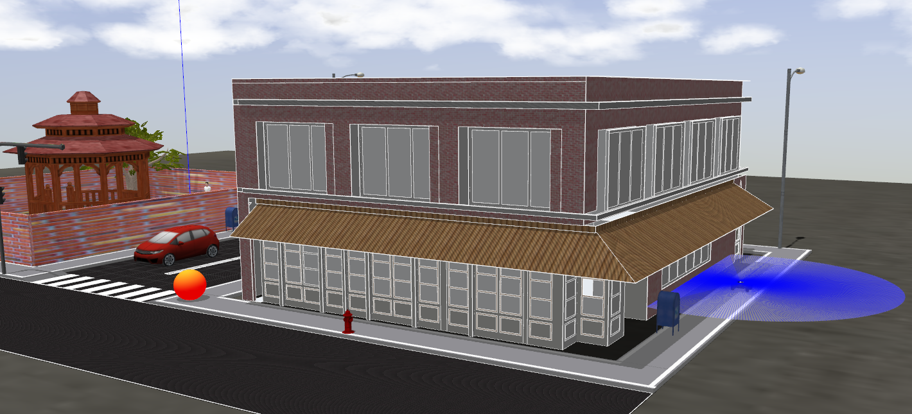
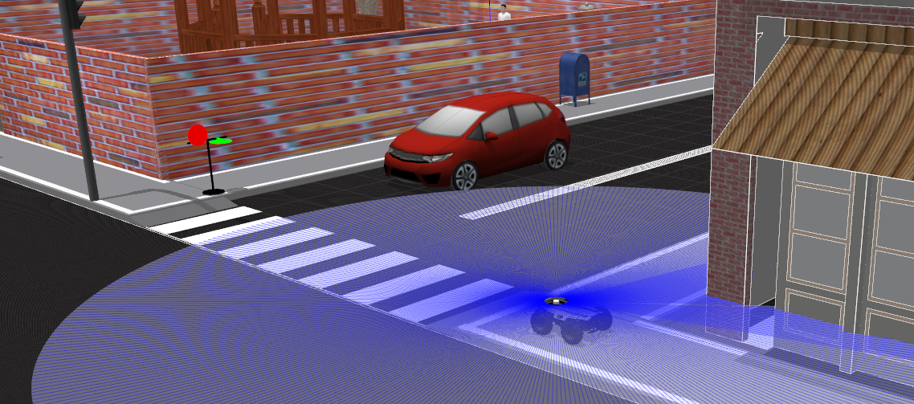

# Phase 1: Simulation

In this simulation-only phase, teams would work on providing solutions to three (3) fundamental tasks of a delivery robot which are: 

* Sidewalk following (with obstacle avoidance)
* Traffic sign detection and recognition
* Go-to-goal navigation (with obstacle avoidance)

The simulation platform to be used in this phase is the [Gazebo Simulator](http://gazebosim.org/). Teams are required to develop, test and submit software to successfully complete these tasks autonomously. This phase will evaluate the teams' capabilities to successfully complete these fundamental tasks required to compete in phase 2 (on the physical robot).

Teams are provided with the delivery robot ROS packages and Gazebo environment models to enable them develop and test their solutions (see [GitHub Repository](https://github.com/PARC-Robotics/PARC-Engineers-League)).

Each task is designed as stand-alone, not depending on other task functionalities, hence, we request teams to complete the tasks separately. The tasks would be evaluated individually and the total team score for this phase would be the sum of individual task scores.


_____________________________________________________________________________
<br>

## Task 1: Sidewalk following


Delivery robots need to be able to navigate safely through street sidewalks as they move from pick up to drop off locations. In this task, we have simplified the sidewalk following problem by adding lanes to the sidewalk. Hence, teams are required to develop software to navigate the robot within the lanes from start to end position. Bear in mind that along with lane following, the robot would be required to avoid obstacles which may lie in its path.

**Task 1 Goal:** The goal of this task is to autonomously control the delivery robot from the start position (initial spawned location) to a goal location on the side walk (to be specified).

- To do this, you need to develop software which *processes sensory information* from the robots sensors (camera and LiDAR) and *generates velocity commands* to control the robot's motion [see here for details].


### Task Guidelines

!!! note
    Make sure you have completed the **Getting Started Tutorials** before starting the tasks.

- Run the following launch file to bring up the delivery robot in the world in a new terminal <br>
    ``` 
    roslaunch parc_engineers task1.launch
    ``` 
    <br>
- You should see the display below in Gazebo. To the right, there's the robot with the visible LiDAR rays (blue rays) and to the left is the orange-red sphere which represents the **goal location**.



- The two locations (robot initial position and goal location) can be set dynamically by passing arguments in the `roslaunch` command:
    - For updating robot initial position: <br>
    ``` 
    roslaunch parc_engineers task1.launch robot_x:-30.43 robot_y:-5.17 robot_yaw:1.57
    ```
    - For updating goal location: <br>
    ``` 
    roslaunch parc_engineers task1.launch goal_x:-12.28 goal_y:2.54
    ```

- You need to create a new launch file which runs ALL the code you need in your solution. Name this launch file: `task1_solution.launch`.

- While developing, we recommend you play around with different start and goal positions to ensure your solution is robust.

- The time-limit to complete this task is **5 minutes (300 secs)**.

!!! note
    Ensure you DO NOT provide a solution with hard-coded positions for the robot to move to or hard-coded obstacle positions because in evaluation, the robot initial position, goal location and locations of obstacles (postbox, fire hydrant, etc.) would be randomized.


### Scoring
The score for this task would be determined using the following metrics:

* Out-of-lane distance penalty
* Final distance from goal location (i.e. euclidean distance from goal position at time-limit)
* No. of collisions penalty
* Completion time

_____________________________________________________________________________

<br>

## Task 2: Traffic sign detection and recognition


Road crossing is inevitable for delivery robots as they navigate our streets to complete their delivery task. The task of road crossing is tricky even for humans to complete safely. A major component of the task is monitoring the traffic sign to ensure you comply with it. In this task, you are required to perform traffic sign detection and recognition. We have included a traffic sign with two states (RED and GREEN). 

Teams are required to develop software to use the on-board camera to detect and recognise the state of the traffic sign. 

**Task 2 Goal:** The goal of this task is to perform safe road crossing by detecting and recognising the state of the traffic sign and crossing only when the state is GREEN (GO).


### Task Guidelines

!!! note
    Make sure you have completed the **Getting Started Tutorials** before starting the tasks.

- Run the following launch file to bring up the delivery robot in the world in a new terminal <br>
    ``` 
    roslaunch parc_engineers task2.launch
    ``` 
    <br>
- You should see the display below in Gazebo. The traffic sign is initially set to RED and would change to GREEN after the `start_delay` duration is complete.

- While developing, we recommend you play around with different values for the `start_delay` duration by passing an argument as follows:
    
    ``` 
    roslaunch parc_engineers task2.launch start_delay:=20
    ```
    <br>

- The time duration from GREEN to RED is set to **20 secs**. This means that you have ~20 secs to cross the road and reach the goal (x=-2.3, y=11.1) after the traffic sign goes green. If the robot is still on the cross walk (i.e. its X position is less than -2.1), the crossing would be considered as failed.



!!! note
    Ensure you DO NOT provide a solution with hard-coded move commands for the robot based on a particular `start_delay` value because in evaluation, the `start_delay` value would be randomized. Also, NO hacks for monitoring the state of the traffic sign (such as checking any ROS topics) would be allowed. If it is found out, you will receive a ZERO score for this task.


### Scoring
The score for this task would be determined using the following metrics:

* Reaction time
* Goal completion i.e. has the robot reached the other side of road by the termination of green signal?
* Wrong crossing (binary)
* Completion time

_____________________________________________________________________________

<br>

## Task 3: Go-to-goal navigation


### Task Guidelines
- **Goal:** Implement software which processes sensory information from the robots sensors (camera and LiDAR) and generates velocity commands to control the robot's motion to move from the start position towards to drop off which is in front of the person standing in the park.
- **Step 1:** Review the "Task 3" folder in the Github repository.
- **Step 2:** Complete the [Setting up your PC] and [Setting up workspace] steps (if you have not already done so).
- **Step 3:** Run the following launch file to bring up the robot in the designated world in a new terminal <br>
` roslaunch <our-robot-package-name> task3.launch `

### Scoring
The score for this task would be determined using the following metrics:

* No. of collisions penalty
* Final distance from goal (set time limit)
* Completion time

_____________________________________________________________________________

<br>

## What to Submit
Teams would submit a zipped folder containing the following:

* Complete catkin workspace **src folder** containing all the installed packages used to complete the task.
* A README file (either .txt, .md, or .pdf) with the following information:
    * List all the packages installed and used in your solution.
    * Provide commands required to run your solution. This should be: <br>
    Task 1: ` roslaunch <your-package-name> task1_solution.launch ` <br>
    Task 2: ` roslaunch <your-package-name> task2_solution.launch ` <br>
    Task 3: ` roslaunch <your-package-name> task3_solution.launch `
* **NOTE:** Please ensure you include all the packages (dependencies) used in your solution in your package's "package.xml" file [see guide]. <br>

The zipped folder should be uploaded using this *solution submission form*.
