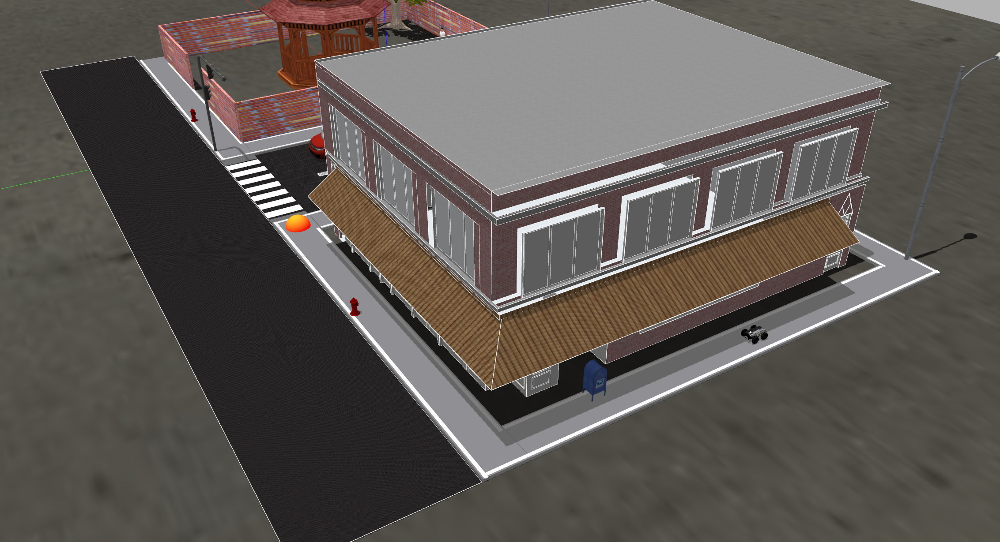

# Task 1: Sidewalk following


Delivery robots need to be able to navigate safely through street sidewalks as they move from pick up to drop off locations. In this task, we have simplified the sidewalk following problem by adding lanes to the sidewalk. Hence, teams are required to develop software to navigate the robot within the lanes from start to end position. Bear in mind that along with lane following, the robot would be required to avoid obstacles which may lie in its path.

**Task 1 Goal:** The goal of this task is to autonomously control the delivery robot from the robot start position to a goal location on the sidewalk.

- To do this, you need to develop software which *processes sensory information* from the robots sensors (camera and LiDAR) and *generates velocity commands* to control the robot's motion [see here for details].


## Task Guidelines

!!! note
    Make sure you have completed the **Getting Started Tutorials** before starting the tasks.

##### 1. Launching the Task

- In a new terminal, run the following launch file to bring up the delivery robot in Gazebo and RViz: <br>
``` 
roslaunch parc-robot task1.launch
``` 
- You should see the display below in Gazebo. To the right, there's the robot and to the left is the orange-red sphere which represents the **goal location**.




##### 2. Explore Multiple Routes

- We have prepared two pre-defined routes you can use as you develop your solution. The default route is `route1`, but you can select the second route option (`route2`) by passing the argument in the `roslaunch` command as follows:

``` 
roslaunch parc-robot task1.launch route:=route2
``` 
- We recommend you play around with at least these two routes to ensure your solution is robust to different start locations.


##### 3. Preparing your Solution

- Your solution should be prepared as ROS packages to be saved in your solution folder [link to how to submit]. Create a launch file in your ROS package which runs ALL the code you need in your solution. Name this launch file: `task1_solution.launch`.

- Hence, your solution to Task 1 should be run by calling the following commands simulatenously: 

In one terminal:
```
roslaunch parc-robot task1.launch
```
In another terminal:
```
roslaunch <your-package-name> task1_solution.launch
```

!!! note
    Ensure you DO NOT provide a solution with hard-coded positions for the robot to move to or hard-coded obstacle positions because in evaluation, the robot initial position and locations of obstacles (postbox, fire hydrant, etc.) would be randomized.


## Task Rules and Scoring

- The time-limit to complete this task is **5 minutes (300 secs)**.

- The task is ONLY **complete** when ANY part of the robot is inside the orange-red sphere (goal location marker).

Scoring for this task would be based on the following criteria:

|  S/N | Criteria / Metric    | Description
| ------------- | ----------- | ----------- |
|  1  | Out-of-lane distance    |  Total distance traveled with any part of the robot lying outside the lane (**Smaller is better**)
|  2  | Final travel distance from goal location   |  Shortest travel distance from robot (measured from robot center) to the goal which is calculated at the time limit [5 minutes] (**Smaller is better**)
|  3  | Collisions   | Number of times the robot comes in contact with either obstacles, building, or walls (**Smaller is better**).
|  4  | Completion time   |  Time from launching the solution to task completion (**Smaller is better**)
