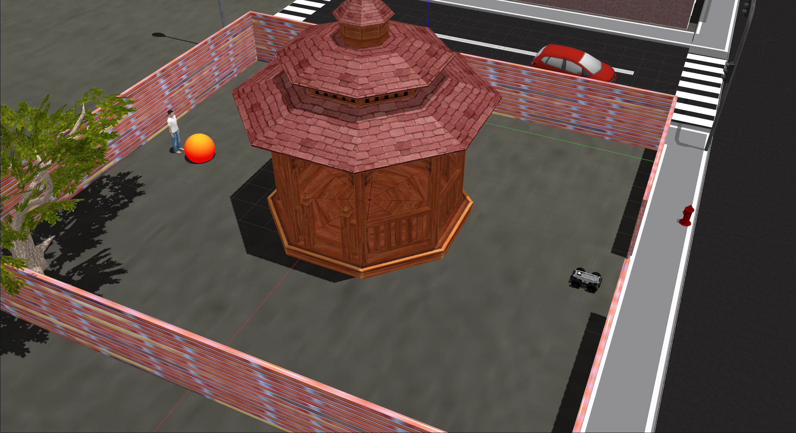

## Task 3: Go-to-goal navigation


The final task of this phase is to navigate safely through a park to reach the customer. The problem here is to navigate in an unconstrained but cluttered terrain without colliding with any obstacles. In this task you are required to move through a collision-free path to the goal using only your on-board sensors.

**Task 3 Goal:** The goal of this task is to autonomously control the delivery robot from the robot start position to a goal location in the park without colliding with obstacles.

- To do this, you need to develop software which *processes sensory information* from the robots sensors (camera and LiDAR) and *generates velocity commands* to control the robot's motion [see here for details].


## Task Guidelines

!!! note
    Make sure you have completed the **Getting Started Tutorials** before starting the tasks.

##### 1. Launching the Task

- In a new terminal, run the following launch file to bring up the delivery robot in Gazebo and RViz: <br>
``` 
roslaunch parc-robot task3.launch
``` 
- You should see the display below in Gazebo. To the right, there's the robot and to the left is the orange-red sphere (the **goal location**) in front of the person.




##### 2. Preparing your Solution

- Your solution should be prepared as ROS packages to be saved in your solution folder [link to how to submit]. Create a launch file in your ROS package which runs ALL the code you need in your solution. Name this launch file: `task3_solution.launch`.

- Hence, your solution to Task 3 should be run by calling the following commands simulatenously: 

In one terminal:
```
roslaunch parc-robot task3.launch
```
In another terminal:
```
roslaunch <your-package-name> task3_solution.launch
```

!!! note
    Ensure you DO NOT provide a solution with hard-coded positions for the robot to move to or hard-coded obstacle positions because in evaluation, the goal locations and locations of obstacles would be randomized.


## Task Rules and Scoring

- The time-limit to complete this task is **8 minutes (480 secs)**.

- For The task is ONLY **complete** when ANY part of the robot is inside the orange-red sphere (goal location marker).

- You will be explicitly scored on the distance traveled, hence, do you best to follow the **shortest path possible** to the goal.

Scoring for this task would be based on the following criteria:

|  S/N | Criteria / Metric    | Description
| ------------- | ----------- | ----------- |
|  1  | Final distance to goal   |  Euclidean distance from robot (measured from robot center) to the goal which is calculated at the time limit [8 minutes] (**Smaller is better**)
|  2  | Collisions   | Number of times the robot comes in contact with either obstacles, building, or walls (**Smaller is better**).
|  3  | Completion time   |  Time from launching the solution to task completion (**Smaller is better**)
|  4  | Total travel distance   |  Travel distance covered by the robot (**Smaller is better**)
