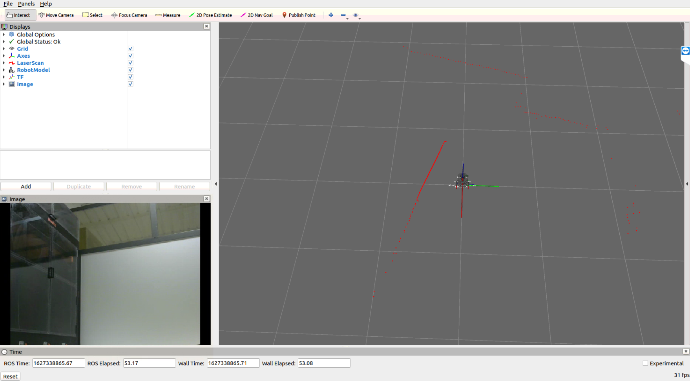

# Testing on Physical Robot

<!-- !!! note
    Coming soon! -->

Teams will be able to test their software on the physical robot once every week for a testing window of two (2) hours. 

### Schedule your Test Time

To schedule your test time every week, please visit the [Test Scheduler](https://www.slottr.com/sheets/18263232). 

* Click "Slot me in" and the insert your team name and email address. 
* You will receive an email containing your login details no later than 1 hour before your session is to begin.
* If you can't find a convenient time on the schedule, we have a back up time every week (3-5pm GMT). Reach out to us here to schedule that.


*** 

## Accessing the Physical Robot

During your scheduled session, you will be provided remote access to control the robot using the following protocol:

* **Remote Desktop Connection:** Using remote desktop software (e.g. TeamViewer), you will be able to remotely view and control the Host PC in our base location in Senegal.
* **SSH (Secure Shell Protocol):** This protocol enable commandline access and remote command execution on the robot PC (Raspberry Pi).


#### Step 0: Prerequisites

Install [TeamViewer](https://www.teamviewer.com/en-us/) remote deskstop software on your PC. For download instructions, see [here](https://www.teamviewer.com/en-us/download/linux/)

#### Step 1: Access the Host PC using TeamViewer

You will receive an email for our technical team on the day of your scheduled session with the following information:

* User ID and Password for accessing the TeamViewer account on the Host PC
* Password of the Host PC

#### Step 2: Open a terminal on the Host PC

We recommend you use the Terminator terminal as it enables you split the terminal screen efficiently.


#### Step 3: Create your own team workspace

Please check the [Team Naming Convention page](./team-names.md) to find your official team numbered name.

```sh
# change directory to "team_workspaces"
cd ~/team_workspaces

# create your team workspace folder, i.e. "<official-team-numbered-name>", e.g. "team-1-asimov"
mkdir -p <official-team-numbered-name>/src

# change directory into the new folder and run the workspace command
cd <official-team-numbered-name> && catkin_init_workspace src

# make your entire workspace
catkin_make
```

#### Step 4: Clone your github repository into your "src" folder

```sh
cd ~/team_workspaces/<official-team-numbered-name>/src
git clone <your-git-repository>
```

#### Step 5: Ensure all your dependencies are installed

```sh
cd ~/team_workspaces/<official-team-numbered-name>/
sudo apt update
rosdep install --from-paths ./src --ignore-src -y

# Also, you might need to manually install any other packages required
```


#### Step 6: Compile your solution

```sh
cd ~/team_workspaces/<official-team-numbered-name>
catkin_make
```

#### Step 7: Find the current IP of the Robot PC (ubuntu)

```sh
# open a new terminal
sudo nmap -sn 192.168.1.0/24
# you will be prompted to provide a password, type: "daust"

# note the IP address of the device with hostname: "ubuntu"
```


#### Step 8: Create a bash session on the robot using the SSH protocol

```sh
# open a new terminal
ssh ubuntu@<IP-address-from-step-7>
# e.g. ssh ubuntu@192.168.1.112

# you will be prompted to provide a password, type: "turtlebot"
```

#### Step 9: Bring up the robot

```sh
# on the host PC, i.e. terminal with "daust@daust", run:
roscore

# on the open robot bash session, i.e. "ubuntu@ubuntu:~$", run
roslaunch turtlebot3_parc turtlebot3_robot.launch

# check that the robot is publishing topics on the ROS network
	# on your host PC:
roslaunch parc-robot robot.launch 
# this will launch RViz and show the robot
```

If everything is working properly, you should have the RViz window looking like the image below:




#### Step 10: Run your solution

```sh
# on the host PC:
source ~/team_workspaces/<official-team-numbered-name>/devel/setup.bash
roslaunch <your-package-name> task_solution.launch
```
<br>
***

## Saving your tests for offline troubleshooting

It is important that you save your data during your testing period to enable you run troubleshooting offline on your own time.
ROS provides a very convenient tool, called [rosbags](http://wiki.ros.org/rosbag/Commandline), to enable you record the data generated during your runs and play them back later.

Please check out the [link](http://wiki.ros.org/rosbag/Commandline) for the official documentation on rosbags.

To give it a try, follow the instructions below:
```sh
# in a new terminal on the host PC, run:
rosbag record -a # this is to record all the topics. This might lead to a very large *.bag file

# check out other rosbag commands such as "play", "compress", etc.
```
Follow this [link](https://www.youtube.com/watch?v=Vlp0e89TXpI) for a video tutorial.

