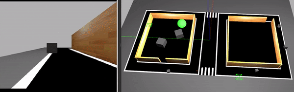
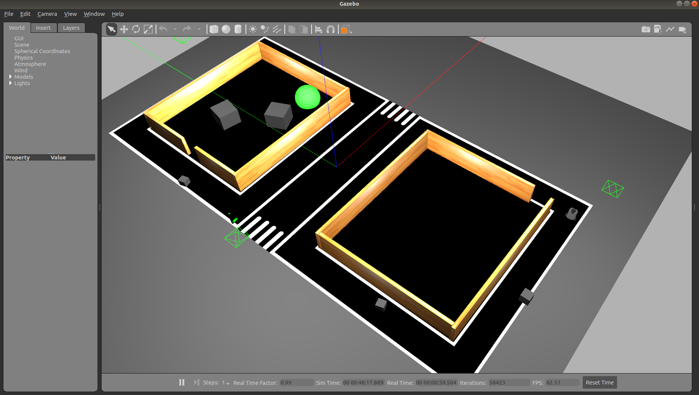
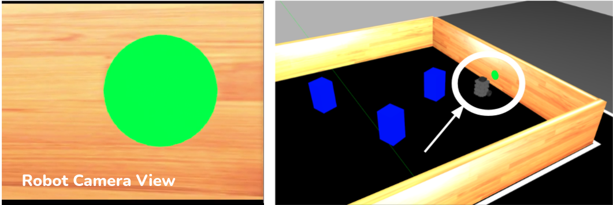

# Developing in Simulation



The goal here is to solve the complete delivery robot navigation task which is a combination of the three tasks completed in Phase 1, namely:

* Sidewalk following (with obstacle avoidance)
* Traffic sign detection and recognition
* Go-to-goal navigation (with obstacle avoidance)

In this Phase 2, you are required to do the following:

* Refine your solution to the different tasks to make sure they function as expected
* Combine your solutions together into one complete solution that manages the different tasks together in real-time (as shown in image above)

## Task Guidelines

!!! note
    Make sure you have completed the [**Getting Started in Simulation**](./getting-started-simulation.md) before starting the task.

##### 1. Launching the Task

- In a new terminal, run the following launch file to bring up the robot in Gazebo and RViz: <br>
```shell
roslaunch turtlebot_parc turtlebot_parc.launch
``` 
- You should see the display below in Gazebo. To the right, there's the robot and to the left is the circular green marker on the wall which represents the **final goal location**.



- The arrow in the figure below shows the robot in the goal location, facing the circular green marker. The goal is to get as close to the green marker and then stop. The robot camera view is also show below.




##### 2. Explore Multiple Routes

- We have prepared two pre-defined routes you can use as you develop your solution. The default route is `route1`, but you can select the second route option (`route2`) by passing the argument in the `roslaunch` command as follows:

``` shell
roslaunch turtlebot_parc turtlebot_parc.launch route:=route2
``` 
- We recommend you play around with at least these two routes to ensure your solution is robust to different start locations.


##### 3. Explore Multiple Start Delays

- We have provided a simple way to set arbitrary values for the traffic light durations such as `red_green_duration`, `yellow_red_duration` and `green_yellow_duration`. This can be done by passing an argument for any or all of them as follows:
    
``` shell
roslaunch turtlebot_parc turtlebot_parc.launch red_green_duration:=10 green_yellow_duration:=8
```

- While developing, we recommend you play around with different values for the traffic light durations to ensure your solution is robust.


##### 3. Preparing your Solution

- Consistent with the approach from Phase 1, your solution should be prepared as ROS packages to be saved in your solution folder. Create a launch file in your ROS package which runs ALL the code you need in your solution. Name this launch file: `task_solution.launch`.

- Hence, your solution should be run by calling the following commands simulatenously: 

In one terminal:
``` shell
roslaunch turtlebot_parc turtlebot_parc.launch
```
In another terminal:
```shell
roslaunch <your-package-name> task_solution.launch
```

!!! note
    Ensure you DO NOT provide a solution with hard-coded positions for the robot to move to or hard-coded obstacle positions because in evaluation, the robot initial position and locations of obstacles would be randomized in the field.


<!-- ## Task Rules and Scoring

- The time-limit to complete this task is **5 minutes (300 secs)**.

- The task is ONLY **complete** when ANY part of the robot is inside the orange-red sphere (goal location marker).

Scoring for this task would be based on the following criteria:

|  S/N | Criteria / Metric    | Description
| ------------- | ----------- | ----------- |
|  1  | Out-of-lane distance    |  Total distance traveled with any part of the robot lying outside the lane (**Smaller is better**)
|  2  | Final travel distance to goal   |  Shortest travel distance from robot (measured from robot center) to the goal which is calculated at the time limit [5 minutes] (**Smaller is better**)
|  3  | Collisions   | Number of times the robot comes in contact with either obstacles, building, or walls (**Smaller is better**).
|  4  | Completion time   |  Time from launching the solution to task completion (**Smaller is better**) -->
